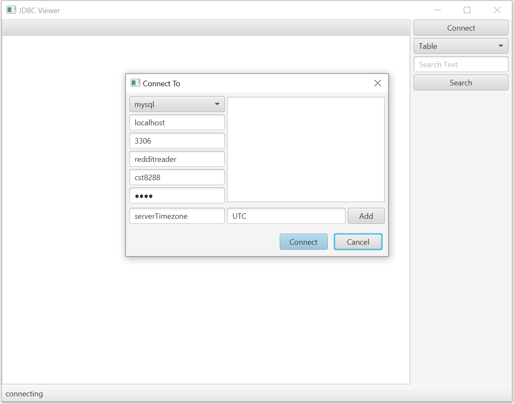
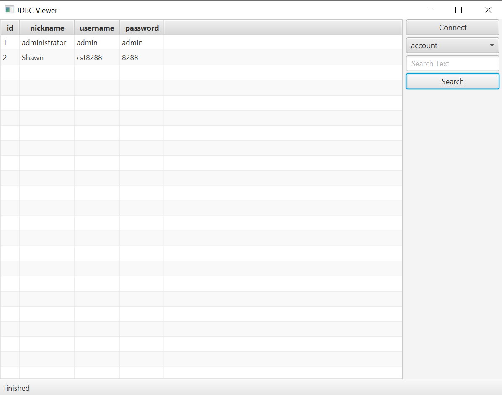
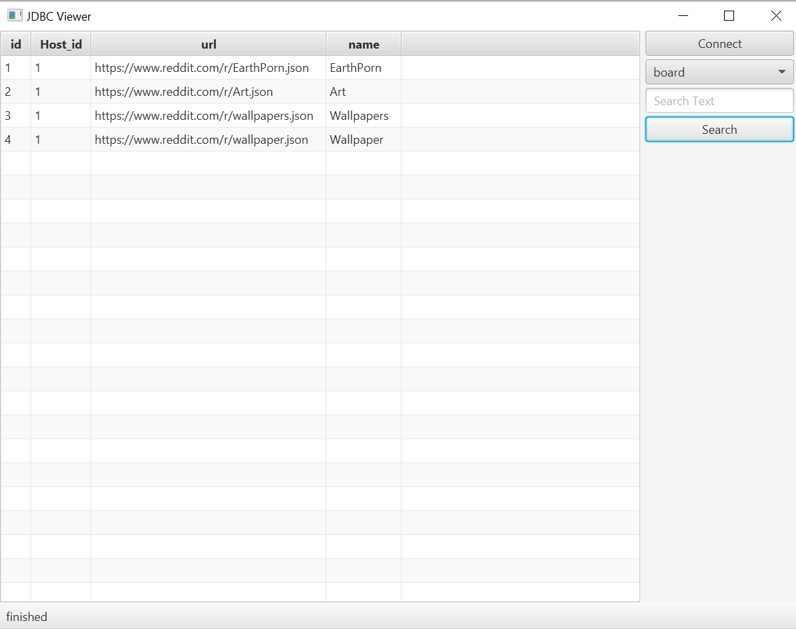
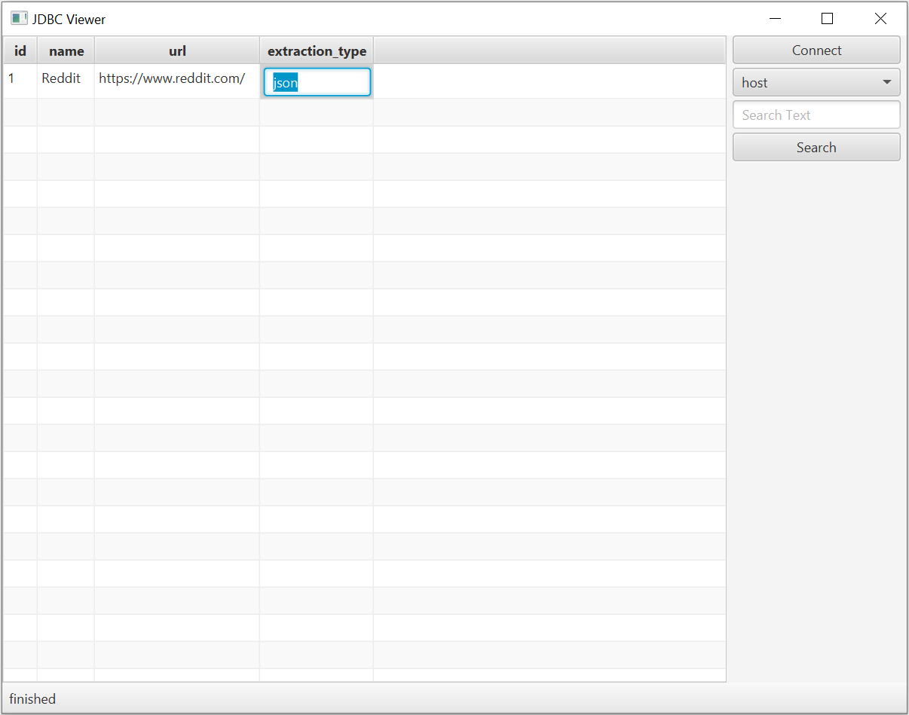
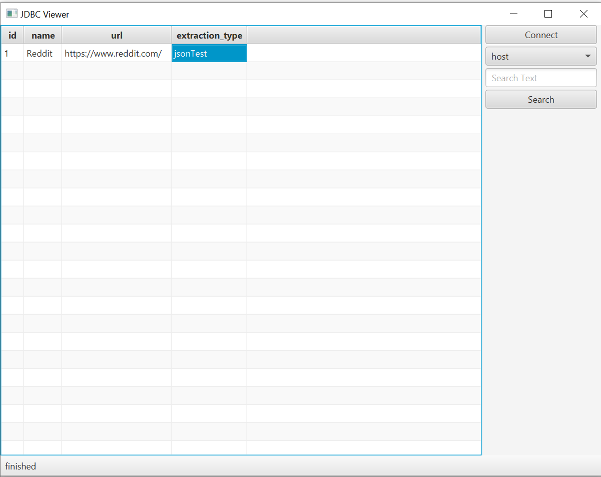

# DBReader
- This porject is using some DPs (Design Pattern). DPs allow the code to be more organized which in turn will make it easier to upgrade and maintain
applications. Sometimes using DPs will require more coding and will make the code more complicated. However, the benefits of decoupling (Layering) and code organization forced by DPs greatly improve the upgradability and maintainability of applications.
- Here two DPs called MVC (Model View Controller) and Builder are used. MVC will handle the separation of JavaFX (GUI/View), JDBC (Model), and Logic (Controller). Builder will allow easier implementation of Connection URL to multiple DBs (only MySQL for this project).

### DBReader Application 

#### Login page

#### Display data in account table

#### Display data in board table

#### Edit data in host table

#### Data edited and updated successfully

